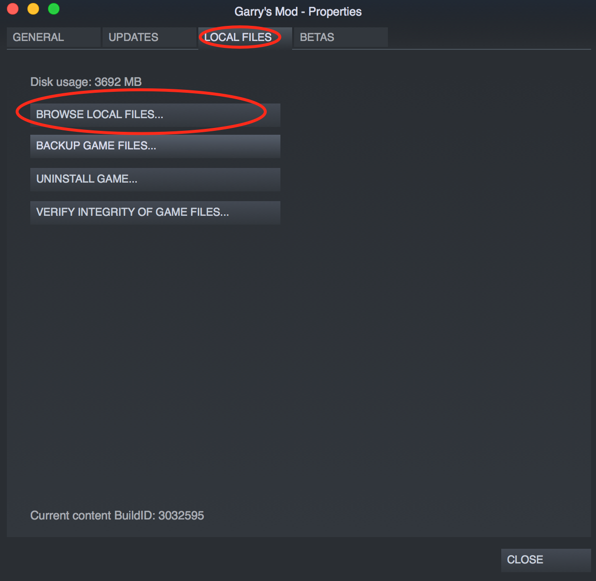
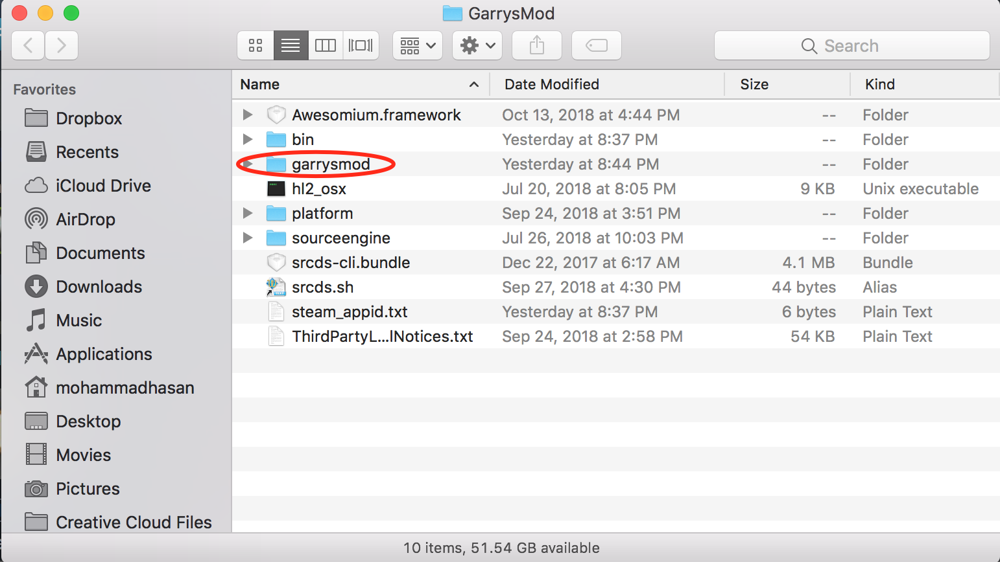
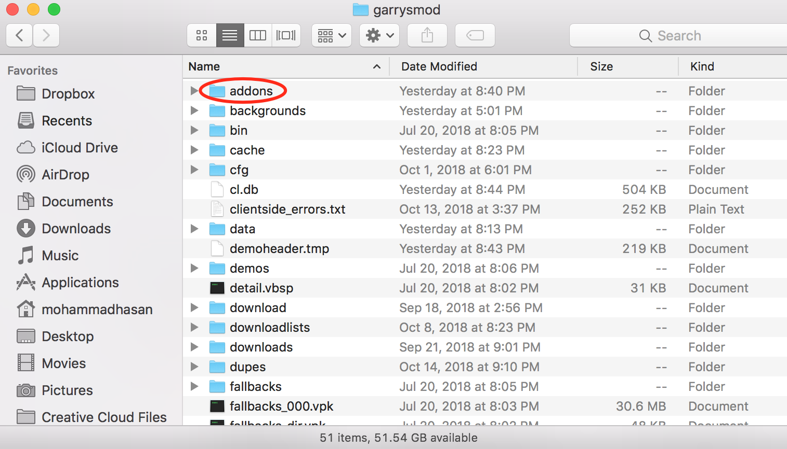
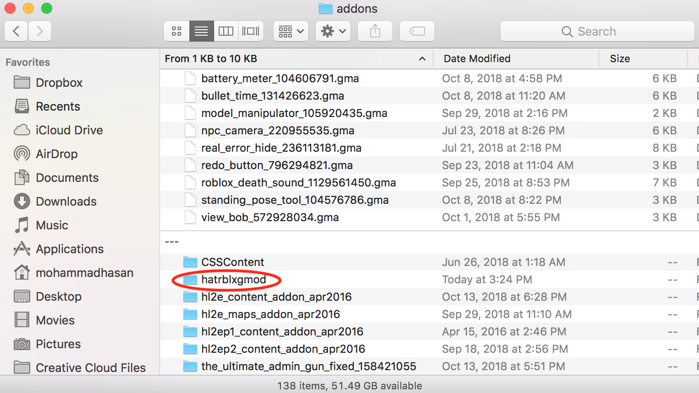
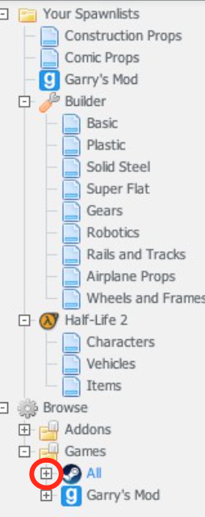
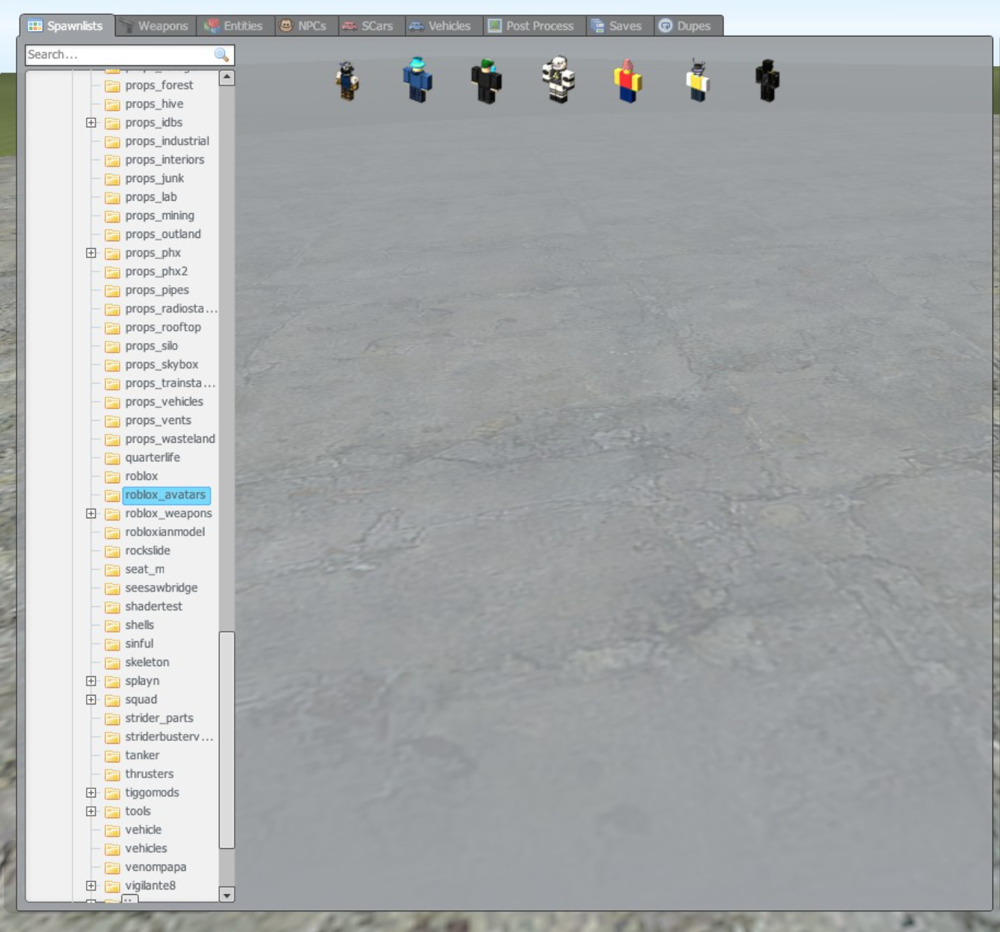
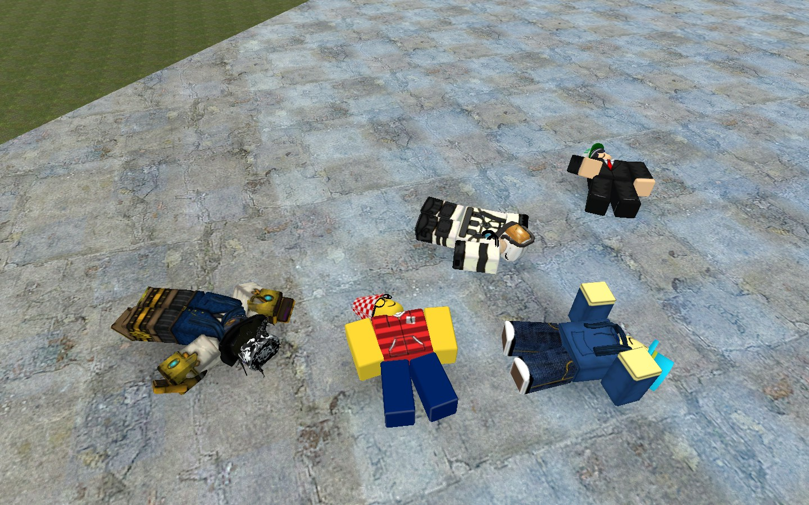
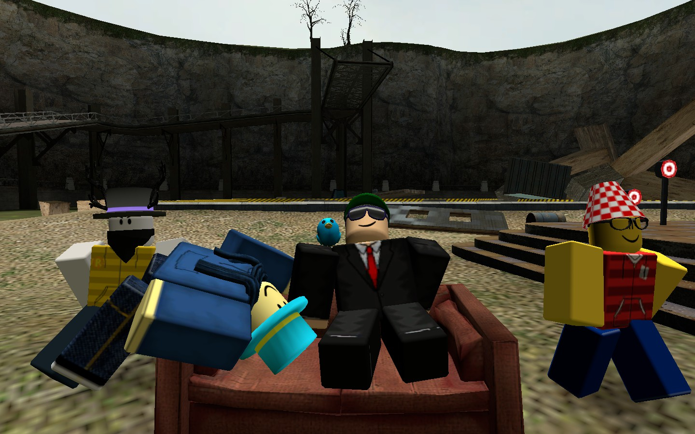
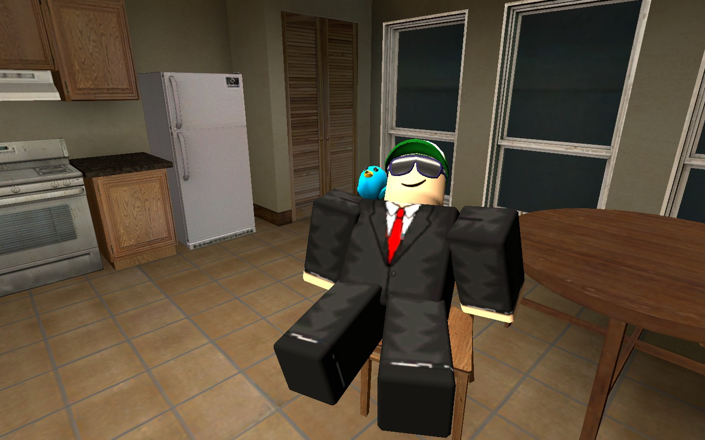

# hatrblxgmod
These are Roblox ragdolls of people I know on Roblox ported to Garry's Mod. Credit to Tdp11 for using Rbx2Source to get these models since Rbx2Source wasn't working for me.
Most credit goes to CloneTrooper1019 for making Rbx2Source that ports Roblox ragdolls to Garry's Mod.
I could not get this on the Steam Workshop, so I am using GitHub to publish this addon instead.

## What Roblox ragdolls this has
- eIio_sun
- H_TMiL
- MohammadHasan2 (me on Roblox)
- survivalmine46
- myalt1562
- Tdp11 (guy who did the ragdolls)
- chriscruz06 (Currently broken, may fix)
More will be added soon.

## How to install
Download the latest build from the Releases tab on this GitHub page and download the "hatrblxgmod.zip" file. Unzip it and you'll get a "hatrblxgmod" folder.

Right click Garry's Mod in your Steam library. Then press Properties.

When you get to Properties, go to Local Files then Browse Local Files.

You will enter your File Explorer and will be in the "GarrysMod" folder. Click the other "garrysmod" folder.

You will find the "addons" folder.

Copy your "hatrblxgmod" folder that you downloaded to the "addons" folder.

You've completed downloading the addon. Now we will show you how to spawn them.

In your spawn menu, click "Games", then "All".

Search for "roblox_avatars". Click it, then spawn the ragdolls.

You're done!

## Example images

I'd like to see what screenshots you can make with these ragdolls, so try contacting me a image you made with these ragdolls
